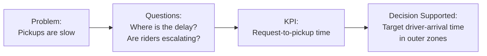
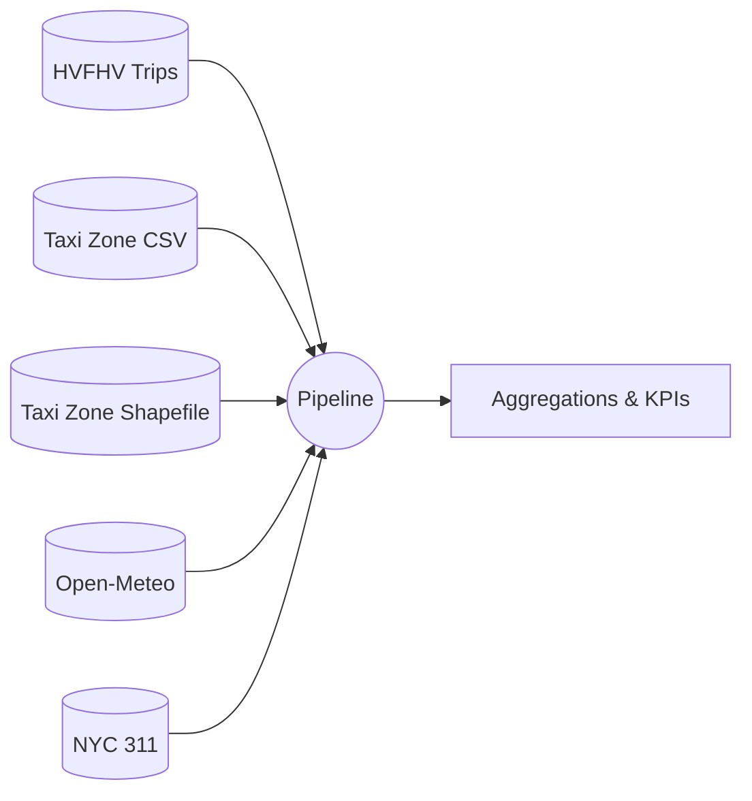
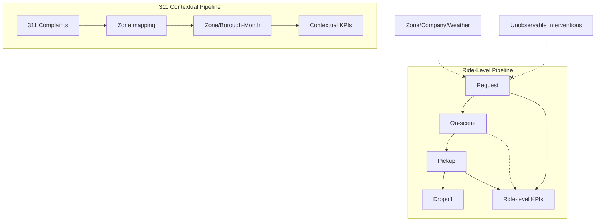
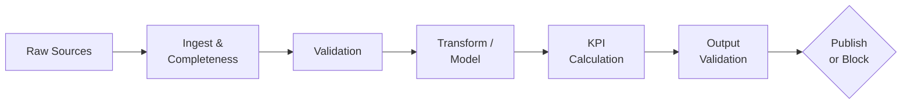

# NYC Ride Operations Reliability Pipeline

**FDE Data Foundations assignment, Track B: NYC TLC.**  
A dependable pipeline converting public NYC ride data from 5 sources into 5 defensible pickup-reliability KPIs.

## 1. Problem & Decision



## 2. Stakeholders

| Stakeholder | Decision the output supports |
|---|---|
| **Operations / supply planning** | Which lifecycle stage (arrival vs curb) and zones to target with supply |
| **Marketplace / dispatch** | Whether dispatch and arrival time is the bottleneck |
| **TLC / policy analyst** | Which boroughs/zones are under-served and where riders complain |
| **Data owners (TLC, licensees)** | Which feed defects to fix (on-scene issues, `trip_time` drift) |

## 3. Source Overview

| Source | Grain | Purpose | Retrieval | Role | Main gap |
|---|---|---|---|---|---|
| **HVFHV trips (TLC)** | trip | lifecycle, zone, company | Parquet file | authoritative | no trip ID; conditional on-scene |
| **Taxi Zone Lookup** | zone | names | CSV file | reference | placeholders (IDs 264/265) |
| **Taxi Zone shapefile**| polygon | 311 placement | ZIP/shapefile | reference | — |
| **Open-Meteo** | hour×cell | weather context | API (JSON) | contextual | 1 cell for all NYC |
| **NYC 311** | complaint| escalations | API (paginated) | contextual | no ride ID; sparse |


*See the full [Source Map](docs/source_map.md) for completeness proofs.*

## 4. Workflow


*See the [Workflow & Data Model](docs/workflow_model.md) for full ER diagrams.*

## 5. Data Model

| Entity | Grain | Relationships |
|---|---|---|
| `ride_journey` | 1 row / ride | Lookups: Zone (pickup/dropoff), Weather (hour) |
| `nyc311_complaints_mapped` | 1 row / complaint | Point-in-polygon mapping to Taxi Zone |
| `zone_breakdown.csv` | 1 row / zone-month | One-to-many aggregation of rides & complaints |
| **Borough-month (KPI 5)** | 1 row / borough-month | One-to-many aggregation of rides & complaints |

## 6. Validation Pipeline & Trust



* **Result (July 2026):** PUBLISHED. 37 checks: 27 PASS, 9 WARN, 0 FAIL, 1 UNKNOWN.
* **Key facts:** 93.4% of rides have an ordered on-scene event; 1.18% have pickup before request (flagged/excluded); 97.7% of 311 complaints mapped to a zone.
* *See detailed [validation report](output/2026-07/validation_report.json).*

## 7. Final KPIs (July 2026)

| # | Metric | Value | Validation | Notes |
|---|---|---|---|---|
| **1** | Median wait | **4.45 min** | UNKNOWN | Pre-scheduled rides unknown; bounds median +0.02 min. |
| **2** | P90 wait | **10.02 min** | UNKNOWN | Tail reliability. Excludes 1.18% anomalous rides. |
| **3** | Driver-arrival share | **≥ 80.5%** | WARN | Lower bound: excludes rides where on-scene == pickup. |
| **4** | P90 wait by zone | **6.7 – 20.7 min** | WARN | Ranks 254 valid zones (excludes placeholders). |
| **5** | Complaints / 100k rides | **≥ 1.13** | PASS | Lower bound: ~4.4% of complaints cannot be mapped. |

*Full metrics and definitions in [metrics.json](output/2026-07/metrics.json) and [evidence_table.md](output/2026-07/evidence_table.md).*

## 8. Knowns, Unknowns, Assumptions & Limitations

| Knowns | Unknowns | Assumptions | Limitations |
|---|---|---|---|
| 20.9M completed rides | Which rides are pre-scheduled | Timestamps are NYC local time | Wait time is rider-experienced, not driver wait |
| 93.4% observed on-scene | Cancelled/unserved requests | 1 weather cell represents NYC | KPIs 3 & 5 are explicitly lower bounds |
| 1,373 311 complaints | Which ride 311 refers to | EPSG:2263 shared across sources | Survivorship bias (completed trips only) |
| 1.18% pickup before req | Proprietary interventions | Raw row ordinal is stable ID | 311 is sparse and covers all FHV types |

## 9. Setup & Run

**Install requirements:**
```bash
python -m pip install -r requirements.txt
```

**Run offline sample (~5s):**
```bash
python run_pipeline.py --sample
```

**Run full month:**
```bash
python run_pipeline.py --month 2026-07
```

**Tests and Failure Demos:**
```bash
python -m unittest -v
python run_pipeline.py --chaos missing_column
python run_pipeline.py --chaos duplicate_rows
python run_pipeline.py --chaos weather_gap
```

## 10. Repository Map

| Artifact | Link |
|---|---|
| **Source Map** | [docs/source_map.md](docs/source_map.md) |
| **Workflow / Data Model** | [docs/workflow_model.md](docs/workflow_model.md) |
| **Data Dictionary** | [docs/data_dictionary/ride_journey.md](docs/data_dictionary/ride_journey.md) |
| **Profiling Notebook** | [notebooks/01_profile_hvfhv.ipynb](notebooks/01_profile_hvfhv.ipynb) |
| **Pipeline Entry Point** | [run_pipeline.py](run_pipeline.py) |
| **Evidence Table** | [output/2026-07/evidence_table.md](output/2026-07/evidence_table.md) |
| **Validation Report** | [output/2026-07/validation_report.json](output/2026-07/validation_report.json) |
