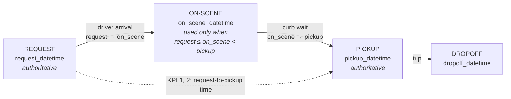
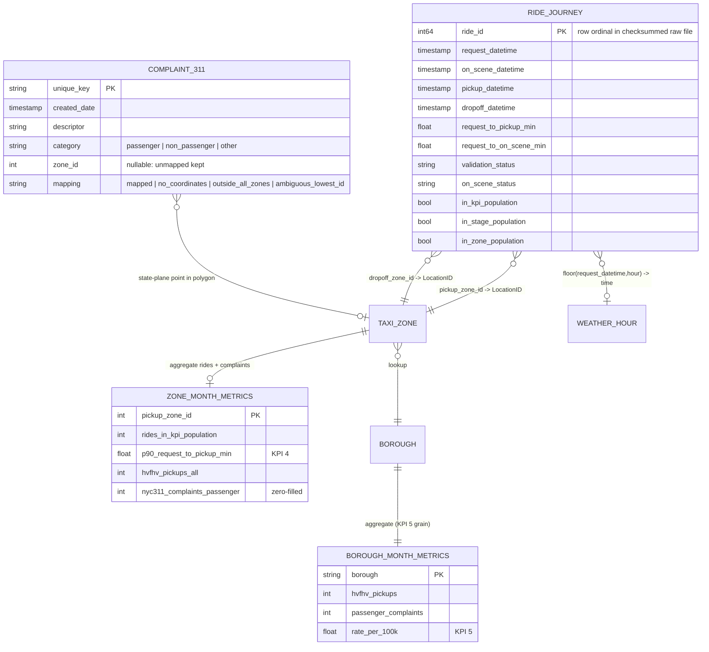

# Workflow and data model

## 1. What is observable, and at what grain

```
Observable ride events      Request ──► [On-scene] ──► Pickup ──► Dropoff        grain: ride
        │                   (on-scene used only where request <= on_scene < pickup: 93.4%)
        ▼
Observable context          Zone (lookup) · Company (licensee) · Weather hour     grain: ride (many-to-one lookups)
        │
        ▼
Customer-friction signal    NYC 311 FHV complaints → taxi zone → borough           grain: zone-month / borough-month
        │                   (no ride ID: never attached to an individual ride)
        ▼
Proprietary interventions   dispatch rules, driver incentives, surge, routing     [NOT OBSERVABLE]
        │
        ▼
Observable outcomes         request-to-pickup time · pickup reliability (P90)      grain: ride → month / zone / borough
```

A client-side case would have its own intervention log. Public NYC data does not include the companies'
operational decisions. Inventing them would make the model look more complete and make it less true. So the
intervention layer is drawn and labelled **unobservable**, and listed as a limitation.

## 2. The ride lifecycle



**Why the headline KPI is request → pickup and not on-scene → pickup.** On-scene → pickup is the driver waiting at
the curb, not the rider's wait. Request → pickup is the rider-experienced interval, and both of its timestamps are
authoritative. On-scene is used only for KPI 3 (*where* inside the wait the time goes), on the subset of rides
where it is a real, ordered event.

## 3. Entities, events, context, signals, outcomes

| Concept | In this project | Grain |
|---|---|---|
| Entity | Ride (trip) | ride |
| Events / states | request, on-scene (conditional), pickup, dropoff; `validation_status`, `on_scene_status` | ride |
| Context | pickup zone and borough, company, request hour/weekday/time period, weather hour | ride (lookups) |
| Customer-friction signal | 311 FHV complaints: passenger, non-passenger, pickup-reliability sub-reasons | complaint → zone-month → borough-month |
| Intervention | proprietary dispatch actions: **not observable** | — |
| Outcome | request-to-pickup time, P90 reliability, driver-arrival share | ride → month / zone / borough |

## 4. Data model



* **`ride_journey`**: one row per ride (20,921,249 for July 2026). Joins are many-to-one only, and the row count is
  asserted. Invalid rides stay in the table with a reason. Columns:
  [`data_dictionary/ride_journey.md`](data_dictionary/ride_journey.md).
* **`nyc311_complaints_mapped.csv`**: one row per complaint with its zone mapping (addresses dropped).
* **`zone_breakdown.csv`**: zone-month: pickup reliability plus 311 counts, zero-filled.
* **Borough-month** (inside `metrics.json`): KPI 5, the one-to-many aggregation of complaints over the matching ride denominator.

## 5. KPI linkage

```
PROJECT KPI         Rider-experienced pickup reliability (request-to-pickup time)
     │
OUTCOME             KPI 1 median · KPI 2 P90                                 → how bad, typical vs tail
     │
WORKFLOW DRIVER     KPI 3 driver-arrival share of the wait (80.5%)           → which stage to act on
     │
WHERE               KPI 4 P90 by pickup zone                                  → where to act
     │
CUSTOMER SIGNAL     KPI 5 passenger 311 complaints / 100k rides (borough)     → does friction follow slowness?
     │
INTERVENTIONS       not observable → what to instrument next (dispatch/incentive log)
```
